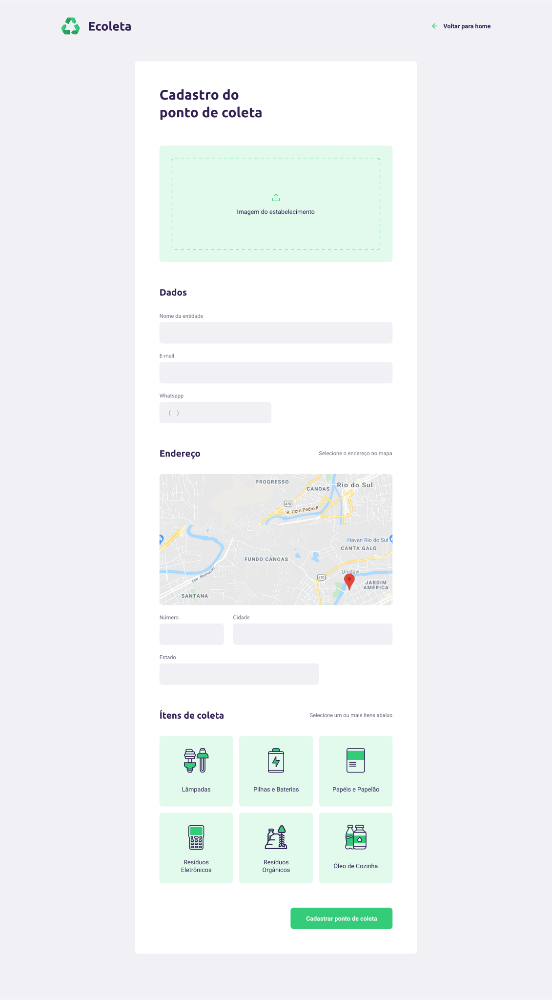

<div align="center"> </div>

[](https://d25lcipzij17d.cloudfront.net/badge.svg?id=js&type=6&v=6.14.4&x2=0) [](https://www.nuget.org/packages/Microsoft.EntityFrameworkCore)  [](LICENSE.md)


# Ecoleta

> O Ecoleta é uma aplicação (web e mobile) com o intuito de facilitar a forma de pessoas encontrarem um ponto de coleta de resíduos. </br>
Como eu particularmente já tenho um bom conhecimento em node e nas funcionalidades do knex resolvi fazer o backend em uma linguagem desconhecida.</br>
Portanto o diferencial neste projeto é o Backend, feito em Asp.Net Core com "Repository Pattern" e usando "Data Transfer Objects" para manter algo mais profissional.

<div align="center"> </div>

## Tecnologias

- [Asp.Net Core](https://docs.microsoft.com/pt-br/aspnet/core/?view=aspnetcore-3.1)
- [EntityFrameworkCore](https://docs.microsoft.com/pt-br/ef/)
- [TypeScript]()
- [React](https://reactjs.org/)
- [React Native](https://facebook.github.io/react-native/)
- [SQLite](https://www.sqlite.org/index.html)
- [Expo](https://expo.io/)

---

## Layout

Preview do Layout Web e Mobile, [layout completo](https://www.figma.com/file/9TlOcj6l7D05fZhU12xWT3/Ecoleta-(Booster)?node-id=0%3A1)

### Web

<div align="center"> </div>

### Mobile

<div align="center"> </div>

## Instalação

Caso queira reproduzir o projeto localmente:

### Clone

- É necessário clonar esse repositório pela url `https://github.com/Andremgps/NLW-1.git`

### Backend

O Backend foi feito com Asp.Net Core usando EntityFramework, portanto é necessário ter o .NET Core CLI instalado.</br>
Tendo o .NET Core CLI instalado basta executar os seguintes comandos na pasta do backend:

```
dotnet restore
dotnet ef database update
dotnet run
```

### Web

A parte web da aplicação foi construida em ReactJS, sendo assim é necessário ter o node instaladp para iniciar o projeto.
Para iniciar a parte web:

```
npm install
npm run start
```

### Mobile

O app mobile foi construido em React Native, usando o expo para construir o app em android e ios.
Para iniciar:

1.Coloque o endereço do seu servidor (ou computador) no arquivo *mobile/src/services/api.tsx*
<br/>
2. Execute os comandos:

Caso não tenha o expo instalado
```
npm install -g expo-cli
```

```
npm install
expo start
```

## Contribuindo

- Faça um fork desse repositório;
- Cria uma branch com a sua feature: `git checkout -b minha-feature`;
- Faça commit das suas alterações: `git commit -m 'feat: Minha nova feature'`;
- Faça push para a sua branch: `git push origin minha-feature`.

Depois que o merge da sua pull request for feito, você pode deletar a sua branch.

---

## License

[](LICENSE.md)

- **[MIT license](http://opensource.org/licenses/mit-license.php)**
- Copyright 2020 © <a href="https://rocketseat.com.br/" target="_blank">Rocketseat</a>.